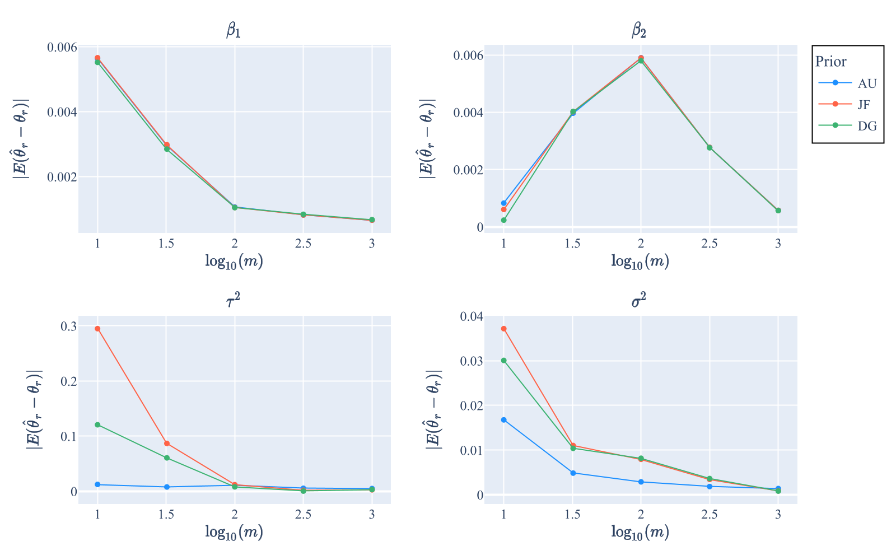

# second-order-unbiased-NER

This repository provides the source code for reproducing the simulation studies on the nested error regression (NER) model, as presented in the paper **"Priors for second-order unbiased Bayes estimators"**. The code allows you to generate data, estimate Bayes estimators using different priors, and create summary plots for performance metrics such as bias, MSE, and coverage probability.

**Paper reference**:  Mana Sakai, Takeru Matsuda, and Tatsuya Kubokawa. (2024). Priors for second-order unbiased Bayes estimators. [arXiv:2412.19187](https://arxiv.org/abs/2412.19187).

### Implementation

To reproduce the results, follow these steps:
1. Setup
   - **Parameter scenarios**: Set `theta_true_ind` in the scripts to select one of the two following settings.
     - `theta_true_ind = 0`: $\beta_{1}=\beta_{2}=\tau^{2}=\sigma^{2}=1$
     - `theta_true_ind = 1`: $\beta_{1}=\beta_{2}=1, \tau^{2}=0.5, \sigma^{2}=4$
   - **OS specification**: Set the appropriate OS option in the scripts. This is necessary for correctly naming output folders.
     - `OS = OS_list[0]` for Windows
     - `OS = OS_list[1]` for macOS
1. Run the scripts
   - **Data generation**
     - `DataGeneration.py`: Generates the simulation data.
   - **Estimation**
     - `Estimation_AU.py`, `Estimation_JF.py`, `Estimation_DG.py`: Estimate Bayes estimators for priors [AU], [JF], and [DG], respectively (refer to the paper for definitions of these priors).
   - **Posterior inference**
     - `Inference_MCMC.py`: Checks MCMC convergence and evaluates posterior metrics (posteiror mean, bias, MSE, and coverage probability).
   - **Result visualization**
     - `ResultPlots.py`: Generates summary pltos.

### Outputs

- Results are saved in folders based on the parameter setting.
  - `output0` for `theta_true_ind = 0`
  - `output1` for `theta_true_ind = 1`
- Example plot: Bias of the posterior mean when the true parameter is $\beta_{1}=\beta_{2}=\tau^{2}=\sigma^{2}=1$
    

### Requirements

- **Python versions**: Tested on Python 3.12.3 (Windows 11) and Python 3.13.0 (macOS 15 Sequoia).
- **Required libraries**:
  - Core: `os`, `multiprocess`, `numpy`, `scipy`
  - For plots: `plotly`, `svglib`, `reportlab`
